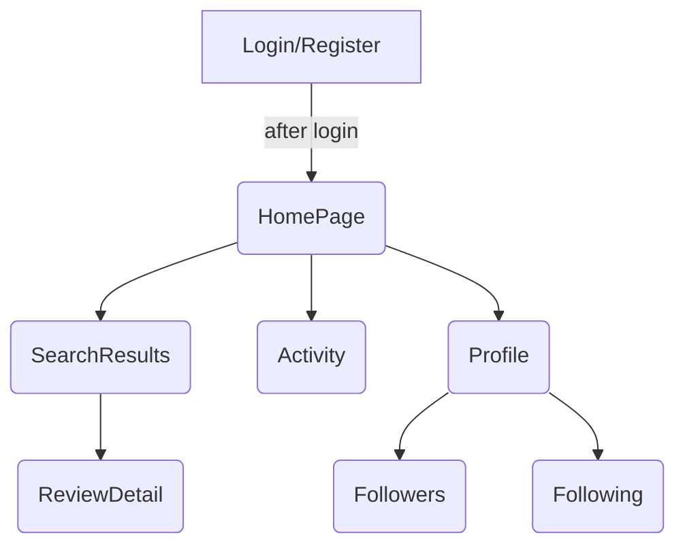

# Halfnote Frontend

This directory contains the React + TypeScript application that powers the UI for **Halfnote**. It provides a minimal testing interface for the Django REST API found in the main repository. New contributors can use this guide to get the project running locally and understand the overall structure.

## Features

- **Authentication flow** (login & register) backed by JWT tokens
- **Protected routes** using a custom `ProtectedRoute` component
- **Album search and review creation**
- **Activity feed** showing follows, likes, reviews and comments
- **Profile pages** with follow/unfollow support
- Styled with **styled-components** and a small custom theme

## Getting Started

1. **Install dependencies**

   ```bash
   npm install
   ```

2. **Configure the API base URL**

   Create an `.env.local` file in this folder with the URL to your backend:

   ```bash
   REACT_APP_API_URL=http://localhost:8000
   ```

   When not provided, the app falls back to `/` in production and `http://localhost:8000` during development.

3. **Run the development server**

   ```bash
   npm start
   ```

   The app will be available at [http://localhost:3000](http://localhost:3000).

4. **Run tests**

   ```bash
   npm test
   ```

5. **Create a production build**

   ```bash
   npm run build
   ```

## Project Structure

```
frontend/
├─ public/                Static assets and HTML template
├─ src/
│  ├─ components/         Reusable UI pieces (Navbar, modals, route guards)
│  ├─ contexts/           React context for authentication
│  ├─ pages/              Top‑level route components
│  ├─ services/           Axios API wrappers
│  ├─ App.tsx             Router and theme setup
│  └─ index.tsx           Application entry point
└─ tsconfig.json          TypeScript configuration
```

### Routing Overview

Routes are declared in `App.tsx`. Most pages require authentication and are wrapped in `ProtectedRoute`.



## Making API Calls

All network requests go through `src/services/api.ts`, which exports small helpers for authentication, music and user endpoints. The file also configures an Axios instance that automatically attaches JWT tokens from `localStorage`.

## Styling and Theme

The app uses **styled-components** with a basic theme defined in `App.tsx` and type declarations in `src/styled.d.ts`. Feel free to extend these values when adding new components.

## Contributing Tips

- Keep components small and focused.
- Pages under `src/pages/` should fetch their own data via the services.
- When introducing new API endpoints, add helper functions to `src/services/api.ts`.

---

Happy hacking! For questions about the API itself, see the main project [README](../README.md).
